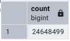
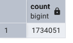
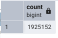

# Homewrok 2
Student Name: JT

## Question 1
```
id: homework_q1
namespace: zoomcamp
description: |
  The CSV Data used in the course: https://github.com/DataTalksClub/nyc-tlc-data/releases

inputs:
  - id: taxi
    type: SELECT
    displayName: Select taxi type
    values: [yellow, green]
    defaults: green

  - id: year
    type: SELECT
    displayName: Select year
    values: ["2019", "2020"]
    defaults: "2019"

  - id: month
    type: SELECT
    displayName: Select month
    values: ["01", "02", "03", "04", "05", "06", "07", "08", "09", "10", "11", "12"]
    defaults: "01"

variables:
  file: "{{inputs.taxi}}_tripdata_{{inputs.year}}-{{inputs.month}}.csv"
  staging_table: "public.{{inputs.taxi}}_tripdata_staging"
  table: "public.{{inputs.taxi}}_tripdata"
  data: "{{outputs.extract.outputFiles[inputs.taxi ~ '_tripdata_' ~ inputs.year ~ '-' ~ inputs.month ~ '.csv']}}"

tasks:
  - id: set_label
    type: io.kestra.plugin.core.execution.Labels
    labels:
      file: "{{render(vars.file)}}"
      taxi: "{{inputs.taxi}}"

  - id: extract
    type: io.kestra.plugin.scripts.shell.Commands
    outputFiles:
      - "*.csv"
    taskRunner:
      type: io.kestra.plugin.core.runner.Process
    commands:
      - wget -qO- https://github.com/DataTalksClub/nyc-tlc-data/releases/download/{{inputs.taxi}}/{{render(vars.file)}}.gz | gunzip > {{render(vars.file)}}

```
### Solution
I entered `Yellow`, `2020`, and `12` as inputed and cheked the size of outputfile under `extract`.
The result was `128.3 MiB`

## Question 2
With input of `taxi: green`, `year: 2020`, and `month: 04`, the result of \
`"{{inputs.taxi}}_tripdata_{{inputs.year}}-{{inputs.month}}.csv"` is \
`green_tripdata_2020-04.csv`.

## Question 3
I used the code from 05_postgres_taxi_scheduled and backfiled it. 
Start date is `2020-01-01 00:00:00` and End date is `2020-12-02 00:00:00`.

It took 30 minutes to extract and load it to postgres. 

In postgres, I used the command \
`SELECT COUNT(*) FROM yellow_tripdata;` \
to find out the number of row.

Answer is `24,648,499` \



## Question 4
Repeated what I did in question 3 with green taxi data.

Answer is `1,734,051` \


## Question 5
Repeated what I did in question 3 with different start and end date.

Answer is `1,,925,152` \


## Question 6
` timezone: America/New_York`